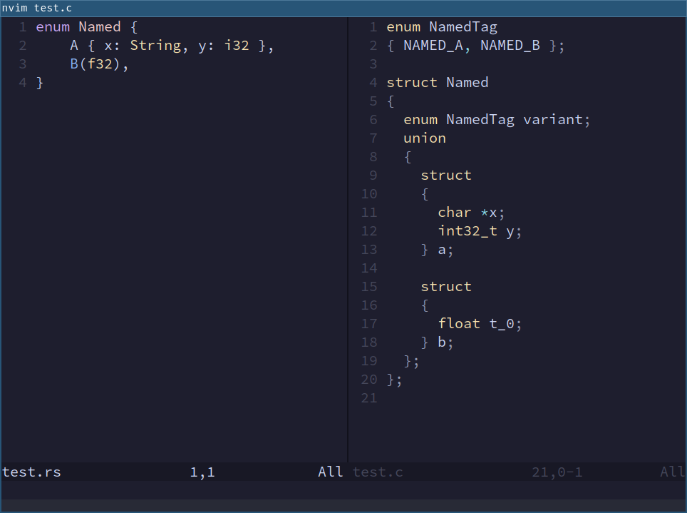

# TagMap

A small program that converts Rust's ML-style [sum types](https://doc.rust-lang.org/book/ch06-01-defining-an-enum.html) into C-style
[tagged unions](https://en.wikipedia.org/wiki/Tagged_union).

## Demonstration
The Rust enum on the left will be converted to the C code on the right.



## Usage
Pre-built binaries can be found in `./bin/`.

```
Convert Rust enums to C tagged unions.

Usage: tagmap [OPTIONS] <INFILE>

Arguments:
  <INFILE>  A Rust source file containing an enum

Options:
  -o, --outfile <OUTFILE>  Path to the output file to write C code
  -f, --format             Format the outputted C code
  -h, --help               Print help
  -V, --version            Print version
```

## Dependencies

For optional formatting of the generated C code, install [indent](https://www.gnu.org/software/indent/)
and make sure it is visible in `$PATH`.
