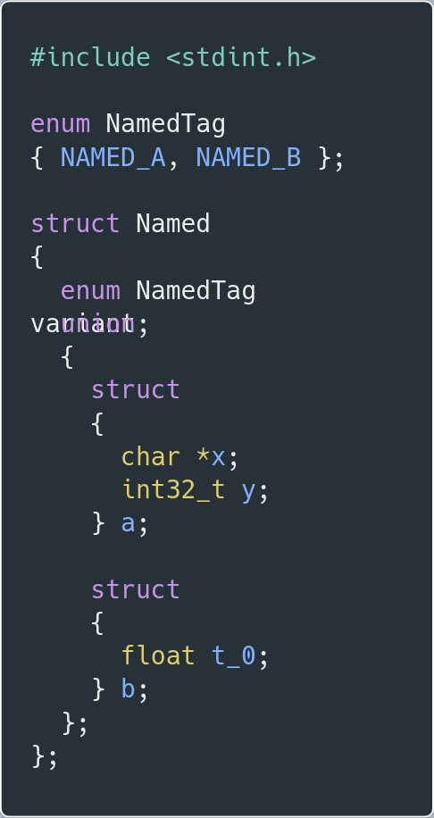

# TagMap

A small program that converts Rust's ML-style [sum types](https://doc.rust-lang.org/book/ch06-01-defining-an-enum.html) into C-style
[tagged unions](https://en.wikipedia.org/wiki/Tagged_union).

  
  &nbsp; &nbsp; &nbsp; &nbsp;
  

-->

## Dependencies

For optional formatting of the generated C code, install [indent](https://www.gnu.org/software/indent/).
